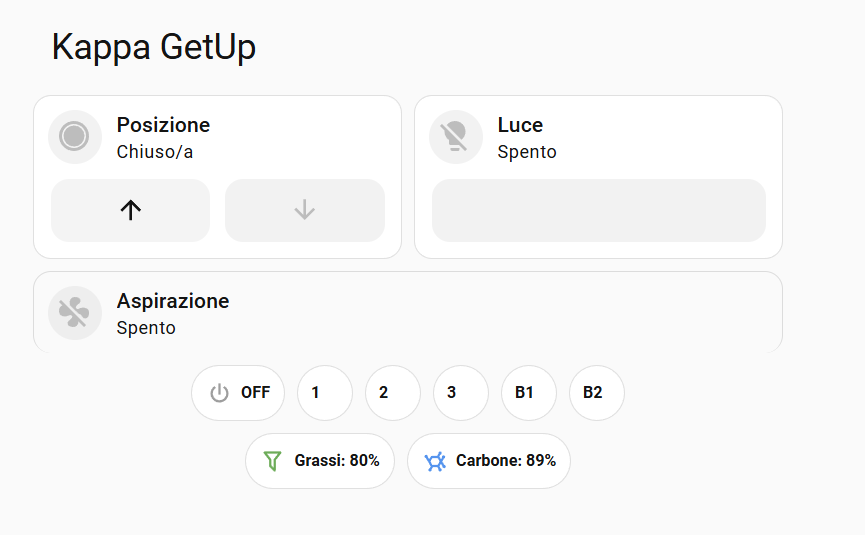

# Elica Getup - Home Assistant Custom Integration

[](https://github.com/custom-components/hacs)
[](https://github.com/dariocaregnato/homeassistant_elica_getup/releases)
[](LICENSE)

**DISCLAIMER**: This is an **unofficial** integration for Elica Getup hoods. It is not affiliated with, endorsed by, or supported by Elica. Use at your own risk. By using this integration, you acknowledge and accept all risks associated with it, including potential issues with your device or Elica account. The author assumes no responsibility for any damages or issues that may arise from using this integration.

## Overview

Custom Home Assistant integration for controlling Elica Getup kitchen hoods via the Elica cloud API. This integration creates a single device with multiple entities for complete hood control.

## Features

This integration creates a single device with the following entities:

### Main Entities
- **Fan** (`fan.getup_fan`): Hood fan control with 5 preset modes
  - Speed 1, 2, 3
  - Boost 1, Boost 2
- **Light** (`light.getup_light`): Light control with brightness adjustment
- **Position** (`cover.getup_position`): Hood movement control (open/close)

### Sensors
- **Grease Filter** (`sensor.getup_filter_grease`): Grease filter efficiency percentage
- **Carbon Filter** (`sensor.getup_filter_carbon`): Carbon filter efficiency percentage

## Installation

### Via HACS (Recommended)

1. Open HACS in Home Assistant
2. Go to "Integrations"
3. Click the three dots in the top right corner and select "Custom repositories"
4. Add repository URL: `https://github.com/dariocaregnato/homeassistant_elica_getup`
5. Select category "Integration"
6. Search for "Elica Getup" and click "Download"
7. Restart Home Assistant

### Manual Installation

1. Copy the `custom_components/elica_getup` folder to your `config/custom_components/` directory
2. Restart Home Assistant

## Configuration

1. Go to **Settings** → **Devices & Services**
2. Click **Add Integration**
3. Search for "Elica Getup"
4. Enter your credentials:
   - **Username**: Your Elica Connect app email address
   - **Password**: Your Elica Connect app password
   - **App Identifier**: A unique identifier for your device (e.g., `af3c7b5d2f17b6da`). You can customize this as you like.
   - **Device Name**: Custom name for your device (default: "Elica Getup")

## Dashboard Example

Using [Mushroom Cards](https://github.com/piitaya/lovelace-mushroom), you can create a beautiful control interface for your Getup hood.



### Lovelace Card Configuration

```yaml
type: vertical-stack
cards:
  - type: custom:mushroom-title-card
    title: Elica GetUp
  - type: horizontal-stack
    cards:
      - type: custom:mushroom-cover-card
        entity: cover.getup_position
        name: Posizione
        show_buttons_control: true
        card_mod:
          style: |
            mushroom-shape-icon {
              
                animation: blink 1s linear infinite;
              
            }
            @keyframes blink {
              50% { opacity: 0.5; }
            }
      - type: custom:mushroom-light-card
        entity: light.getup_light
        name: Luce
        show_brightness_control: true
        use_light_color: true
        collapsible_controls: false
  - type: vertical-stack
    cards:
      - type: custom:mushroom-fan-card
        entity: fan.getup_fan
        name: Aspirazione
        icon_animation: true
        show_percentage_control: false
        card_mod:
          style: |
            ha-card {
              box-shadow: none;
              border-bottom: none;
              background: none;
            }
            mushroom-shape-icon {
              
              --icon-color: 
                 var(--rgb-disabled)
                 var(--rgb-green)
                 var(--rgb-blue)
                 var(--rgb-orange)
                 var(--rgb-red) ;
              
              animation: 
                
                   rotation 2s linear infinite
                   rotation 1.2s linear infinite
                   rotation 0.8s linear infinite
                   rotation 0.4s linear infinite 
                 none ;
            }
            @keyframes rotation {
              0% { transform: rotate(0deg); }
              100% { transform: rotate(360deg); }
            }
      - type: custom:mushroom-chips-card
        alignment: center
        chips:
          - type: template
            content: "OFF"
            icon: mdi:power
            icon_color: "grey"
            tap_action:
              action: call-service
              service: fan.turn_off
              target:
                entity_id: fan.getup_fan
          - type: template
            content: "1"
            icon_color: >-
              green
            tap_action:
              action: call-service
              service: fan.set_preset_mode
              service_data:
                preset_mode: "1"
              target:
                entity_id: fan.getup_fan
          - type: template
            content: "2"
            icon_color: >-
              blue
            tap_action:
              action: call-service
              service: fan.set_preset_mode
              service_data:
                preset_mode: "2"
              target:
                entity_id: fan.getup_fan
          - type: template
            content: "3"
            icon_color: >-
              orange
            tap_action:
              action: call-service
              service: fan.set_preset_mode
              service_data:
                preset_mode: "3"
              target:
                entity_id: fan.getup_fan
          - type: template
            content: B1
            icon_color: >-
              red
            tap_action:
              action: call-service
              service: fan.set_preset_mode
              service_data:
                preset_mode: Boost 1
              target:
                entity_id: fan.getup_fan
          - type: template
            content: B2
            icon_color: >-
              red
            tap_action:
              action: call-service
              service: fan.set_preset_mode
              service_data:
                preset_mode: Boost 2
              target:
                entity_id: fan.getup_fan
        card_mod:
          style: |
            ha-card {
              box-shadow: none;
              background: none;
              padding-top: 0;
            }
  - type: custom:mushroom-chips-card
    alignment: center
    chips:
      - type: template
        content: "Grassi: {{ states('sensor.getup_filter_grease') }}%"
        icon: mdi:filter-outline
        icon_color: green
      - type: template
        content: "Carbone: {{ states('sensor.getup_filter_carbon') }}%"
        icon: mdi:molecule
        icon_color: blue
    card_mod:
      style: |
        ha-card {
          box-shadow: none;
          background: none;
        }
```

## Technical Notes

- The integration polls the Elica cloud API every 60 seconds
- Hood movement (open/close) takes approximately 28 seconds to complete
- Before turning on the fan or light, the hood automatically opens if closed
- All communication is done via Elica's cloud API

## Troubleshooting

### Authentication Failed
- Verify your Elica Connect app credentials are correct
- The App Identifier can be any string - try something simple like `af3c7b5d2f17b6da`

### Entities Not Updating
- Check your internet connection
- Verify the Elica cloud service is operational
- Check Home Assistant logs for errors

## Support

For issues, questions, or feature requests, please open an issue on [GitHub](https://github.com/dariocaregnato/homeassistant_elica_getup/issues).

## Disclaimer

This integration is provided "as is" without warranty of any kind. The author is not responsible for any damage to your device, loss of data, or any other issues that may arise from using this integration. Use at your own risk.

This is an independent project and is not affiliated with, endorsed by, or supported by Elica S.p.A.

## License

MIT License - see [LICENSE](LICENSE) file for details.

## Credits

Developed by [@dariocaregnato](https://github.com/dariocaregnato) for the Home Assistant community.
